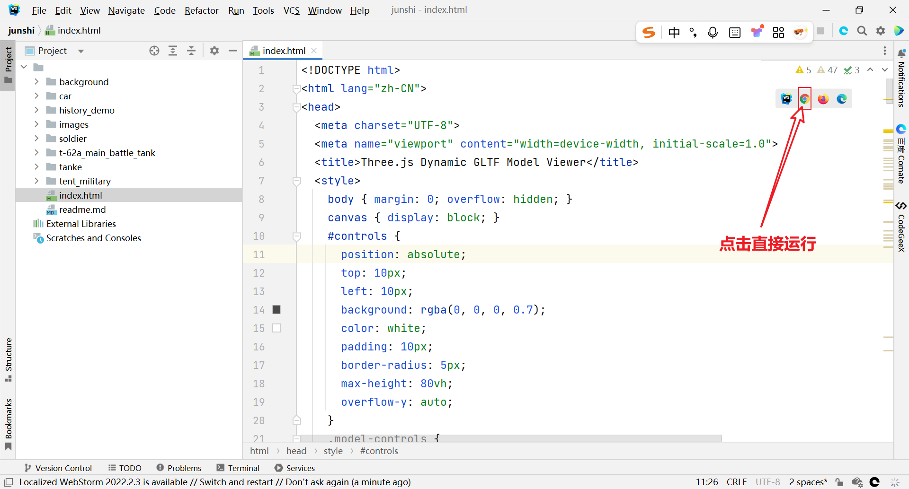
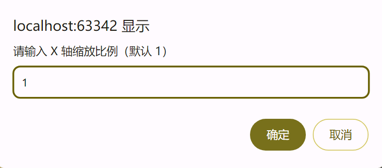
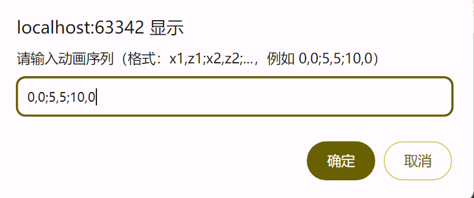
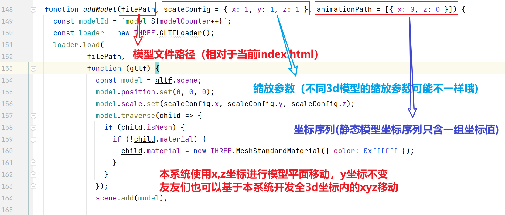
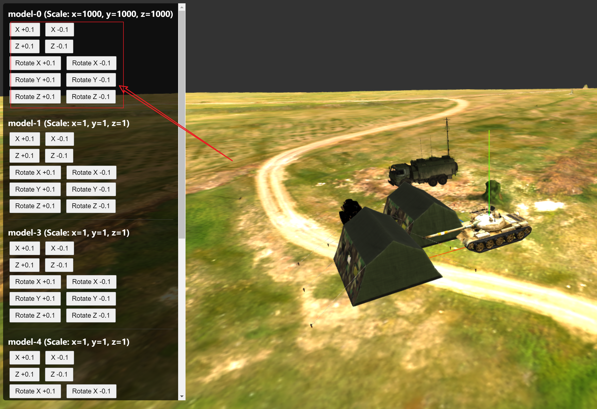
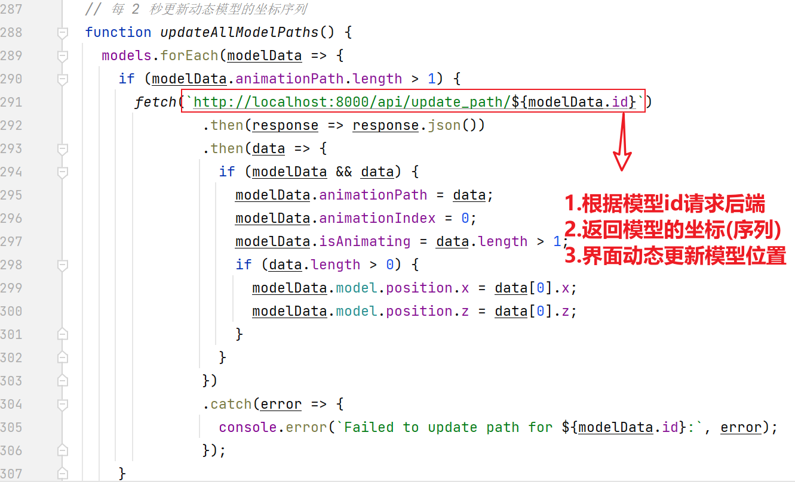

# Three.js Dynamic GLTF Model Viewer

## 系统简介
Three.js Dynamic GLTF Model Viewer 是一个基于 Three.js 构建的 3D 模型展示和交互系统，旨在提供一个动态的 Web 环境，用于加载、展示和管理 GLTF 格式的 3D 模型。该系统支持实时渲染多个模型，允许用户添加新模型、修改模型位置和旋转，并通过后端接口动态获取模型坐标，实现模型的动态路径更新。系统适用于教育演示、虚拟场景设计或简单的 3D 模拟应用。

当前系统包含一个固定背景模型和多个动态模型，运行在浏览器中，并通过前端与后端协同工作，提供流畅的 3D 体验。

## 系统截图


## 核心功能
1. 3D 模型展示：
- 使用 Three.js 渲染 GLTF 格式的 3D 模型，支持多模型同时展示。
- 包含一个固定背景模型（默认加载 ./background/scene.gltf），替代传统的平面地图。
- 动态模型支持缩放、位置调整和旋转控制。
2. 模型增删：
- 提供“添加模型”按钮，用户可以通过提示输入模型文件路径、缩放比例和动画路径，动态添加新模型。
- 支持删除模型（通过手动移除或刷新页面清空）。
3. 模型位置修改：
- 提供交互式控制面板，用户可以手动调整动态模型的 X、Z 坐标（步长 0.1）和 X、Y、Z 轴旋转（步长 0.1）。
- 背景模型位置固定在 (0, -6, 0)，无法修改。
4. 模型坐标动态获取：
- 每 2 秒通过后端接口（/api/update_path/{model_id}）异步获取动态模型的最新坐标序列。
- 更新后，模型会平滑过渡到新路径，增强动态效果。
5. 场景交互：
- 集成 OrbitControls，支持用户通过鼠标拖动、缩放和旋转视角，查看 3D 场景。
- 提供坐标轴辅助工具，便于定位模型。

## 如何使用
### 运行环境准备
推荐前端开发工具WebStorm,运行本项目超级方便，无需配置环境。

[下载链接](https://www.jetbrains.com/webstorm/download/#section=windows)


由于模型文件较大，完整可运行项目请到我的网盘下载[百度网盘下载链接](https://pan.baidu.com/s/1JT_8IWcIKczPzPoCgre_VQ?pwd=7wkz)。

### 视角控制
使用鼠标左键拖动：旋转视角。

使用鼠标滚轮：缩放视角（受 minDistance 和 maxDistance 限制）。

使用鼠标右键拖动：平移视角（受 screenSpacePanning 限制）。
### 新增模型
1. 页面添加模型：





点击“添加模型”按钮，输入模型文件路径、缩放比例和动画路径。
- 输入 GLTF 文件的相对路径（例如 ./model/scene.gltf）。
- X 轴缩放比例：输入 X 轴缩放值（默认 1）。
- Y 轴缩放比例：输入 Y 轴缩放值（默认 1）。
- Z 轴缩放比例：输入 Z 轴缩放值（默认 1）。
- 动画序列：输入坐标序列，格式为 x1,z1;x2,z2;...（例如 0,0;5,5;10,0），表示模型移动路径。

提交后，新模型将加载并显示，初始位置基于动画序列的第一个点。

2. 代码动态添加模型：

调用 `addModel` 函数，传入模型文件路径、缩放比例和动画序列。
   

### 修改模型位置和旋转：
1. 页面修改：
   
- 在左侧控制面板中，找到目标模型的控制区域（以 model-{数字} 命名）。
- 使用以下按钮调整位置：
  (1). X +0.1 / X -0.1：沿 X 轴移动 0.1 单位。
  (2). Z +0.1 / Z -0.1：沿 Z 轴移动 0.1 单位。
- 使用以下按钮调整旋转：
  (1). Rotate X +0.1 / Rotate X -0.1：沿 X 轴旋转 0.1 弧度。
  (2). Rotate Y +0.1 / Rotate Y -0.1：沿 Y 轴旋转 0.1 弧度。
  (3). Rotate Z +0.1 / Rotate Z -0.1：沿 Z 轴旋转 0.1 弧度。
- 调整后，模型位置会实时更新。

2. 代码修改：
调用 `model.position[axis] += value; model.rotation[axis] += value;` 函数，更改新的 X、Z 坐标。

### 动态获取模型坐标
每 2 秒，系统通过后端接口 `/api/update_path/{model_id}` 获取动态模型的最新坐标序列。

更新后的路径会平滑应用，模型会移动到新坐标。

后台需提供 `/api/update_path/{model_id}` 接口返回 JSON 格式数据（见后端接口部分）。


### 删除模型：
调用 `scene.remove(model);` 或刷新页面清空所有模型。
## 后端接口
后端使用 FastAPI 提供动态坐标更新服务，运行在 http://localhost:8000。以下是接口详情：
1. 获取模型路径更新
- URL: `/api/update_path/{model_id}`
- 方法: GET
- 参数:
  - model_id (string): 模型的唯一标识符，例如 model-0、model-1。
- 响应:
  - 成功:返回 JSON 数组，包含坐标序列。
  格式: [{ "x": float, "z": float }, ...]
  示例: [{"x": 0, "z": 0}, {"x": 5, "z": 5}, {"x": 10, "z": 0}]
  - 失败: 返回错误信息（由前端记录至控制台）。
- 用途: 每 2 秒由前端调用，更新动态模型的动画路径。

### 示例代码：
```python
from fastapi import FastAPI
from fastapi.middleware.cors import CORSMiddleware
from pydantic import BaseModel
from typing import List
import random
from datetime import datetime

app = FastAPI()

# 允许跨域请求
app.add_middleware(
    CORSMiddleware,
    allow_origins=["*"],
    allow_credentials=True,
    allow_methods=["*"],
    allow_headers=["*"],
)


# 定义坐标点模型
class Point(BaseModel):
    x: float
    z: float


# 模拟数据库：存储每个模型的坐标序列
model_paths = {
    "model-0": [
        {"x": 0, "z": 0},
        {"x": 5, "z": 5},
        {"x": 10, "z": 0},
        {"x": 5, "z": -5},
        {"x": 0, "z": 0}
    ],
    "model-1": [
        {"x": -10, "z": -10}
    ],
    "model-2": [
        {"x": 0, "z": 0},
        {"x": -5, "z": 5},
        {"x": -10, "z": 0}
    ],
    "model-3": [
        {"x": 0, "z": 0}
    ]
}


# API 端点：返回指定模型的初始路径
@app.get("/api/path/{model_id}", response_model=List[Point])
async def get_path(model_id: str):
    return model_paths.get(model_id, [{"x": 0, "z": 0}])


# API 端点：返回指定模型的动态更新路径
@app.get("/api/update_path/{model_id}", response_model=List[Point])
async def update_path(model_id: str):
    base_path = model_paths.get(model_id, [{"x": 0, "z": 0}])
    current_time = datetime.now().second
    if model_id == 'model-3':
        return base_path
    new_path = base_path.copy()  # 基于初始路径生成动态变化
    new_path = [new_path[-1]]
    # 模拟动态更新：根据时间添加随机偏移
    point = new_path[-1]
    point["x"] += random.uniform(-2, 2)
    point["z"] += random.uniform(-2, 2)
    if len(new_path) < 3:  # 确保至少有 3 个点
        new_point = {"x": point["x"] + random.uniform(-5, 5), "z": point["z"] + random.uniform(-5, 5)}
        new_path.append(new_point)

    return new_path

```

### 运行:
```python
安装依赖: pip install fastapi uvicorn

运行: uvicorn main:app --reload --port 8000
```

## 注意事项
1. 模型文件
   确保所有 GLTF 文件路径正确且可访问。
2. 系统性能
   过多模型或频繁更新可能影响性能，建议优化后端响应时间或调整 setInterval 间隔。
3. 跨域请求
   后端需启用 CORS（已包含在示例代码中），否则前端请求可能失败。
4. 前端调试
   使用浏览器的开发者工具查看控制台，检查错误和调试信息。


## 技术栈
- 前端：Three.js、HTML5、CSS3、JavaScript
- 后端：FastAPI (Python)

## 相关资源
1. Three.js 文档: [Three.js Documentation](https://threejs.org/docs/)
2. FastAPI 文档: [FastAPI Documentation](https://fastapi.tiangolo.com/)
3. GLTF 文件格式: [glTF](https://www.khronos.org/gltf/)
5. 3d 模型资源: [Sketchfab](https://sketchfab.com/)
5. 3d 模型资源: [Cgmszj](https://www.cgmszj.com/)
5. 3d 模型资源: [Free3d](https://free3d.com/)
6. 在线 3D 查看器: [3d viewer](https://3dviewer.net/)
7. 在线 3D 编辑器: [gltf nsdt](https://gltf.nsdt.cloud/)
8. 在线 3D 文件转换: [Convertio](https://convertio.co/zh/)

## 版本
- 2025-05-19 06:21 PM PDT: 初始版本发布，支持基本模型展示、添加、位置修改和动态坐标获取。新增支持多个动态模型（tank, soldier, tent, car）。

## 联系方式
- QQ: `1307854753`
- 微信: `1307854753`
- email: `jiabaow@mail.nwpu.edu.cn`


## 后续开发计划
- 实现更复杂的动画和交互效果。
- 支持更多类型的 3D 文件格式。
- 优化性能和加载速度。
- 提供用户自定义视角保存与分享功能。

## 贡献者
该项目由多位开发者共同完成，具体贡献者可查阅项目的历史提交记录。

## 许可证
本项目采用 MIT 许可证，详情请参阅 LICENSE 文件。

## 如何贡献
欢迎任何形式的贡献！你可以通过以下方式参与项目：

1. Fork 本仓库。
2. 创建你的特性分支 (`git checkout -b feature/amazing-feature`)。
3. 提交你的更改 (`git commit -am 'Add some amazing feature'`)。
4. 推送分支到 GitHub (`git push origin feature/amazing-feature`)。
5. 创建新的 Pull Request。
